# 4. 连接设计和Testbench  
　　验证设计需要几个步骤：生成激励，捕获响应，确定正确性并衡量进度。但是，首先需要一个合适的测试平台，并连接到设计，如图4.1所示。
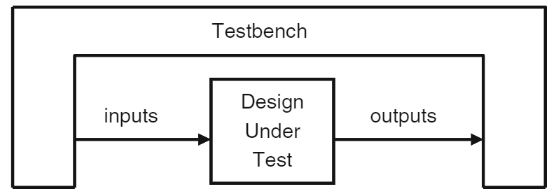   
图4.1测试平台–设计环境   
　　您的测试台环绕设计，发送激励并捕获设计的响应。测试台形成了设计的“真实世界”，模仿了整个环境。例如，处理器模型需要连接到各种总线和设备，这些总线和设备在测试台中被建模为总线功能模型。网络设备连接到基于标准协议建模的多个输入和输出数据流。视频芯片连接到发送命令的总线，然后形成写入内存模型的图像。 关键概念是测试平台可以模拟被测设计中没有的所有内容。  
　　与Verilog的端口和易于出错的连接页面相比，您的测试平台需要一种更高层次的方式与设计进行通信。 您需要一种可靠的方式来描述时序，以便始终在正确的时间驱动和采样同步信号，并且所有交互都没有Verilog模型常见的竞争条件。    

## 4.1 分离测试平台和设计　　　　　　　　　
　　在理想的世界中，所有项目都有两个独立的组：一个用于创建设计，另一个用于验证设计。 在现实世界中，有限的预算可能要求您同时戴两顶帽子。    
　　每个团队都有自己的一套专门技能，例如创建可综合的RTL代码，或寻找新的方法来发现设计中的错误。 这两个小组各自阅读原始设计规范并做出自己的解释。 设计人员必须创建符合该规范的代码，而作为验证工程师的工作是创建设计与描述不匹配的方案。   
　　同样，您的测试平台代码与设计代码位于单独的块中。 在经典的Verilog中，每个组件都放在单独的模块中。 但是，使用模块固定测试台通常会导致驱动和采样周围的时序问题，因此SystemVerilog引入了程序块来从逻辑上和时间上分离测试台。有关更多详细信息，请参见第4.3节。  
　　随着设计复杂度的增加，模块之间的连接也增加了。
两个RTL块可能共享数十个信号，必须以正确的顺序列出它们才能正确通信。 一种不匹配或错位的连接，该设计将无法正常工作。 您可以使用“按名称连接”语法来减少错误，但这会使您的键入负担增加一倍以上。 如果这是一个细微的错误，例如仅偶尔切换针脚，您可能会在一段时间内未注意到该问题。 更糟糕的是，当您在两个模块之间添加新信号时。 您不仅需要编辑添加新端口的块，还需要编辑连接设备的更高级别的模块。 同样，任何级别的错误连接都会使设计停止工作。 更糟糕的是，系统只会间歇性地失败！  
　　解决方案是接口，即代表一束电线的SystemVerilog构造。 此外，您可以指定时序，信号方向，甚至添加功能代码。 接口像模块一样被实例化，但是像信号一样连接到端口。  
### 4.1.1 Testbench与DUT之间的通信  
　　接下来的几节显示了使用单独信号并再次使用接口连接到仲裁器的测试平台。 图4.2是顶层设计的示意图，包括测试平台，仲裁器，时钟发生器以及连接它们的信号。该DUT（被测设计）是一个琐碎的设计，因此您可以专注于SystemVerilog概念，而不会陷入设计的困境。 在本章的最后，显示了一个ATM路由器。  
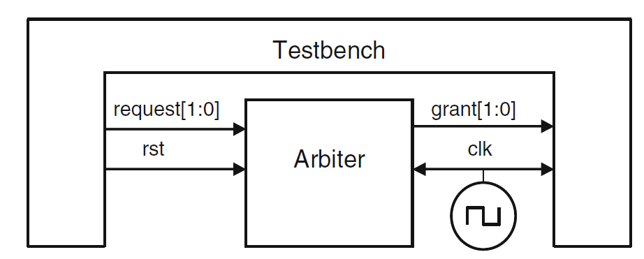  
图4.2 Testbench –不带接口的仲裁器   
### 4.1.2 与端口的通讯 
　　以下代码显示了将RTL模块连接到测试平台所需的步骤。首先是仲裁模型的头部，如示例4.1所示。 它使用Verilog-2001样式的端口声明，其中类型和方向在头部中。为了清楚起见，省略了一些代码。  
　　如2.1.1节中所述，SystemVerilog扩展了经典的reg类型，因此您可以像使用wire一样使用它来连接块。 认识到它的新功能，reg类型具有logic的新名称。 不能使用logic变量的唯一地方是具有多个结构驱动程序的网络，在这里必须使用诸如wire之类的网络。  
示例4.1 使用端口的仲裁器模型  
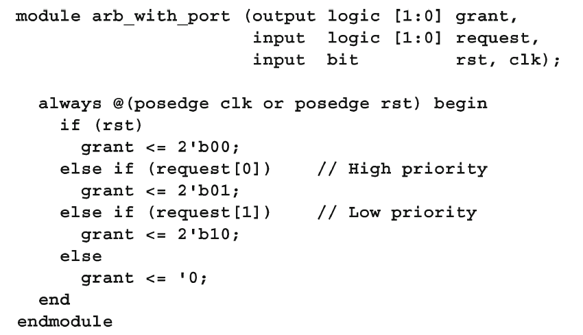  
　　示例4.2中的测试平台保存在一个模块中，以使其与设计分离。通常，它通过端口连接到设计。    
示例4.2 使用端口的测试台模块  
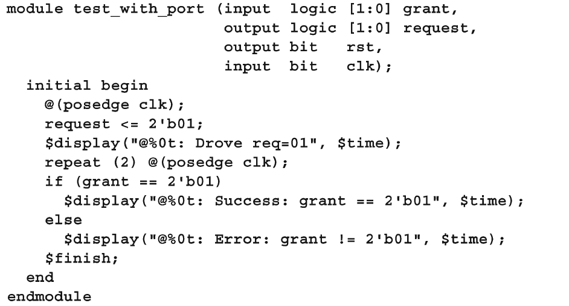  
　　顶层模块连接测试平台和DUT，并包括一个简单的时钟发生器。  
示例4.3 带端口的顶层模块  
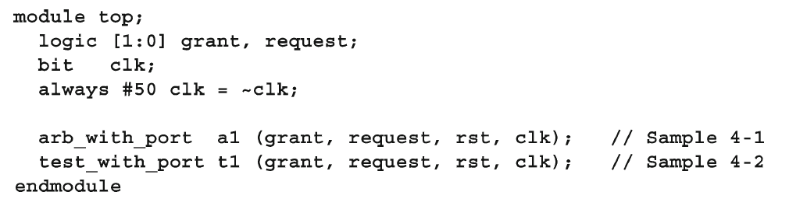  
　　在示例4.3中，模块很简单，但是具有数百个引脚的实际设计需要数页信号和端口声明。 所有这些连接都容易出错。 当信号穿过多层层次结构时，必须不断声明和连接。 最糟糕的是，如果您只想添加新信号，则必须声明该信号并将其连接到多个文件中。  SystemVerilog接口可以在每种情况下提供帮助。  
## 4.2 接口构造  
　　设计变得如此复杂，以至于甚至块之间的通信也可能需要被分离成单独的实体。 为了对此建模，SystemVerilog使用了您可以认为是智能电线束的接口构造。 它包含两个或多个块之间的连通性，同步以及可选的通信功能，以及可选的错误检查。 它们连接设计模块和/或测试平台。  
　　Sutherland（2006）中介绍了设计级接口。 本书着重于连接设计模块和测试平台的接口。  
### 4.2.1 使用接口简化连接  
　　仲裁器示例的第一个改进是将导线捆绑在一起形成接口。 图4.3显示了使用接口进行通信的测试台和仲裁器。请注意，接口是如何扩展到两个模块中的，它们代表了驱动程序和接收器，它们在功能上是测试和DUT的一部分。 时钟可以是接口的一部分，也可以是单独的端口。  
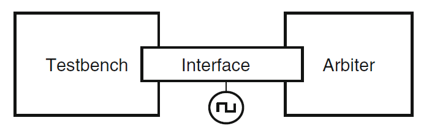  
图4.3 一个跨越两个模块的接口  
　　最简单的接口只是一束双向信号，如示例4.4所示。使用logic数据类型，以便您可以驱动过程语句中的信号。  
示例4.4 仲裁器的简单接口  
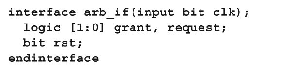  
　　示例4.5是被测设备，仲裁器，它使用接口而不是端口。  
示例4.5 使用简单接口的仲裁器  
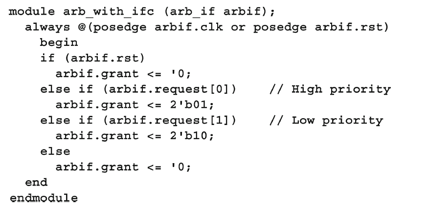  
　　示例4.6显示了测试平台。 您可以通过使用实例名称arbif.request进行分层引用来引用接口中的信号。 接口信号应始终使用非阻塞分配进行驱动。 这将在4.4.3和4.4.4节中详细解释。  
示例4.6 使用简单的仲裁器接口的测试平台  
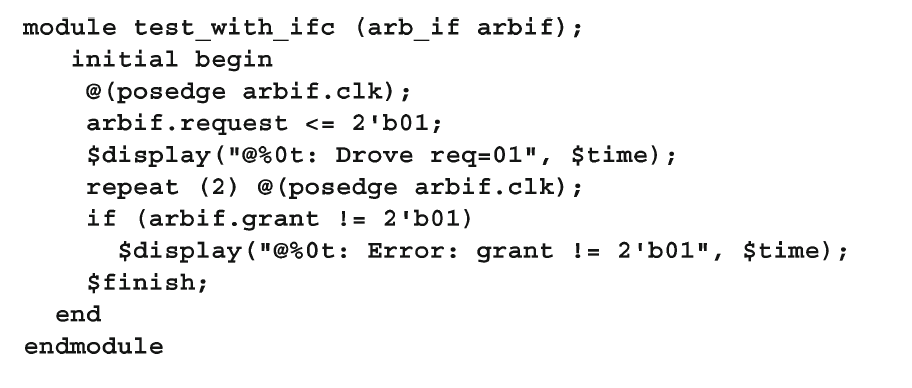  
　　如示例4.7所示，所有这些块都在顶层模块中实例化并连接。  
示例4.7 带有简单仲裁器接口的顶层模块  
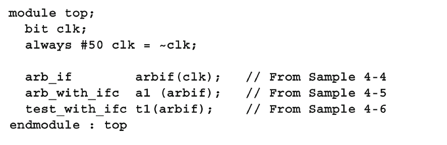  
　　即使在这种小型设备上，您也可以立即受益：连接变得更干净，更不容易出错。 如果要在接口中添加新信号，只需要将其添加到接口定义和实际使用它的模块中。 您不必更改任何仅使接口通过的模块，例如top。 此语言功能大大减少了接线错误的可能性。  
　　本书仅显示具有单个时钟的接口，该接口在顶层连接到发生器。 如果您的接口需要多个时钟，请像对待接口内的其他信号一样对待它们，然后将接口连接到时钟发生器。 如果您在较高级别上工作并将接口视为基于周期的构造，则您的工作效率更高。 下一级别是基于事务的，这超出了典型的RTL代码。  
　　确保在模块和程序块之外声明接口。 如果忘记了，会遇到各种各样的麻烦。 某些编译器可能不支持在模块内部定义接口。如果允许，则该接口对于模块而言将是本地的，因此对于其余设计而言是不可见的。 样本4.8显示了在其他include语句之后立即包含接口定义的常见错误。  
示例4.8 错误的测试模块——包括接口  
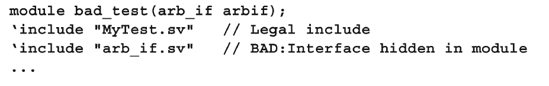  
### 4.2.2 连接接口和端口  
　　如果您的Verilog-2001旧版设计的端口无法更改为使用接口，则只需将接口的信号连接到各个端口即可。 示例4.9将原始仲裁程序从示例4.1连接到示例4.4中的接口。  
示例4.9 将接口连接到使用端口的模块  
  
### 4.2.3 使用Modport在接口中对信号进行分组  
　　示例4.5使用了点对点连接方案，该接口中没有信号方向。 使用端口的原始模块具有此信息，编译器使用该信息来检查接线错误。 接口中的modport构造使您可以对信号进行分组并指定方向。示例 4.10中的MONITOR modport允许您将监视器模块连接到接口。  
示例4.10 含有Modports的接口  
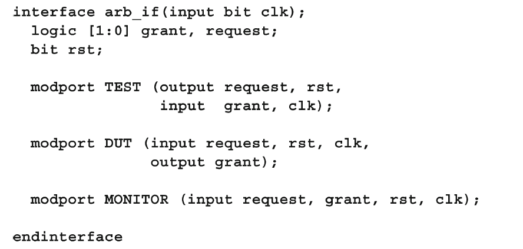  
　　示例4.11显示了仲裁器模型和测试平台，其端口连接列表中包含modport。 请注意，您将modport名称DUT或TEST放在接口名称arb_if之后。 除了modport名称外，它们与前面的示例相同。  
示例4.11 具有使用Modports接口的仲裁器模型  
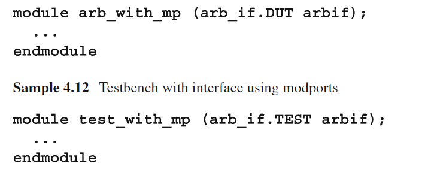  
　　即使代码变化不大（除了接口变大以外），该接口也更准确地表示实际设计，尤其是信号方向。有两种方法可以在设计中使用这些Modport名称。您可以在连接到接口信号的模块中指定它们。 在这种情况下，除了模块名称外，顶级模型与示例4.7相同。 本书推荐这种样式，因为modport是实现细节，不应使顶层模块混乱。  
　　替代方法是在实例化模块时指定modport，如示例4.13所示。  
示例4.13带有Modport的顶层模块  
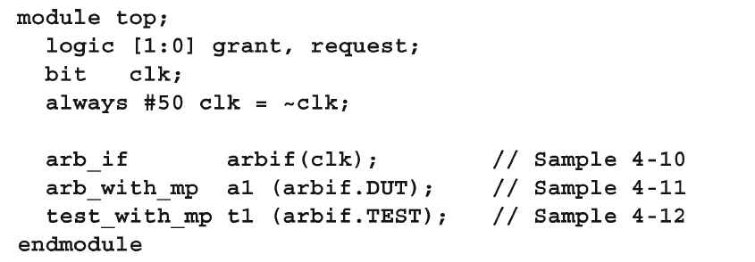  
使用这种样式，您可以灵活地多次实例化一个模块，每个实例都连接到不同的modport，即接口信号的不同子集。 例如，一个字节宽的RAM模型可以连接到32位总线上的四个插槽之一。 在这种情况下，您需要在实例化模块时指定modport，而不是在模块本身中。  
　　请注意，Modport在接口中定义，并在模块端口列表中指定，但从不在信号名称中指定。 名称arb_if.TEST.grant是非法的！  
### 4.2.4 在总线设计中使用Modports  
　　并非每个信号都需要进入每个modport。 考虑使用接口建模的CPU –内存总线。  CPU是总线主控器，它驱动信号的子集，例如request，command和address。 存储器是从机，接收这些信号并准备就绪。 主从驱动器数据。 总线仲裁器仅查看request和grant，而忽略所有其他信号。 因此，您的接口将具有用于主机，从机和仲裁器的三个Modport，以及一个可选的Monitor Modport。  
### 4.2.5 创建接口监视器  
　　您可以使用MONITOR modport创建总线监视器。 样本4.14显示了仲裁器的普通监视器。 对于真正的总线，您可以解码命令并打印状态：完成，失败等。  
示例4.14具有使用Modport的接口的Arbiter监视器  
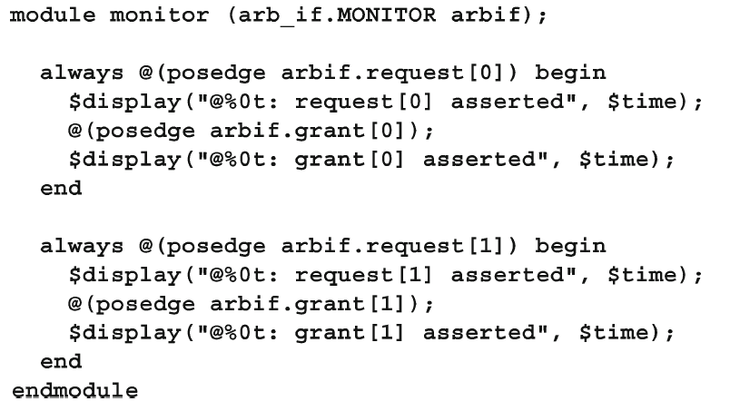  
### 4.2.6 接口权衡  
　　接口不能包含模块实例，只能包含其他接口的实例。与使用端口连接信号的传统端口相比，在使用带有Modport的接口时需要权衡取舍。  
　　使用接口的优点如下。  
　　•接口是设计重用的理想选择。当两个模块使用两个以上的信号与指定协议通信时，请考虑使用接口。 如果像在网络交换机中那样一遍又一遍地重复信号组，则应另外使用虚拟接口，如第10章所述。  
　　•接口将您在每个模块或程序中一遍又一遍声明的信号混杂在一起，并将其放在中央位置，从而减少了错误连接信号的可能性。  
　　•要添加新信号，只需在接口中而不是在更高级别的模块中声明一次，即可再次减少错误。  
　　•Modport使模块可以轻松地从接口提取信号的子集。 您可以指定信号方向以进行其他检查。  
　　使用接口的缺点如下。  
　　•对于点对点连接，带有modport的接口几乎与使用带有信号列表的端口一样冗长。 接口的优点是所有声明仍位于一个中央位置，从而减少了出错的机会。  
　　•现在，除了信号名称外，您还必须使用接口名称，这可能会使模块更冗长，但更易于调试。  
　　•如果您使用唯一的协议连接两个设计模块，并且这些协议不会重复使用，则接口的工作可能不仅仅是将端口连接在一起。 连接两个不同的接口很困难。 新接口（b us_if）可以包含现有接口的所有信号（arb_if），以及新信号（地址，数据等）。 您可能需要分解各个信号并适当地驱动它们。  

